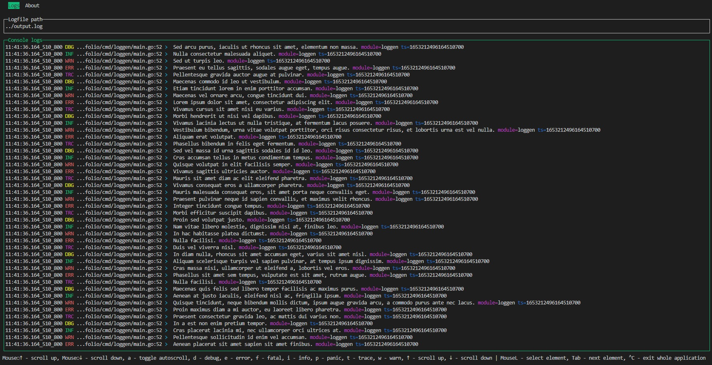

# Log Viewer

Did you ever struggle with reading the structured logs from a file? If so, the **Log Viewer** is here to rescue you!
It is a GUI that you can run directly in your favorite command line and it will show you your logs in a beautiful colorful way and help you with their browsing and filtering.

Other features that it has are:

* **Filtering** the log output to show only the logs above a certain level

    - the supported levels are `trace`, `debug`, `info`, `warn`, `error`, `fatal` and `panic`,

* Support for **large files** (up to multiple GB)

* If the viewed log file is growing, it can **follow** the written logs in real-time

* Special handling of certain fields in the structured log:    

    * `level` field is used to derive the level of the log and shown in the log header    

    * `caller` field is shortened to 30 characters and shown in the log header
    * `time` field is parsed and shown in nanosecond precision at the log beginning
    * `message` field is shown right after the leader
    * `module` field is highlighted differently for better readability

## What it looks like



Example contents of the log file:
```
[...]
{"level":"error","module":"loggen","caller":"/github.com/matusvla/logviewer/cmd/loggen/main.go:52","time":"2022-05-22T11:41:36.0627773+02:00","ts":1653212496062777300,"message":"Vestibulum bibendum, urna vitae volutpat porttitor, orci risus consectetur risus, et lobortis urna est vel nulla."}
{"level":"trace","module":"loggen","caller":"/github.com/matusvla/logviewer/cmd/loggen/main.go:52","time":"2022-05-22T11:41:36.0627773+02:00","ts":1653212496062777300,"message":"Aliquam erat volutpat."}
{"level":"debug","module":"loggen","caller":"/github.com/matusvla/logviewer/cmd/loggen/main.go:52","time":"2022-05-22T11:41:36.0628021+02:00","ts":1653212496062802100,"message":"Phasellus bibendum in felis eget fermentum."}
{"level":"info","module":"loggen","caller":"/github.com/matusvla/logviewer/cmd/loggen/main.go:52","time":"2022-05-22T11:41:36.0628021+02:00","ts":1653212496062802100,"message":"Sed vel massa id urna sagittis sodales id id leo."}
{"level":"warn","module":"loggen","caller":"/github.com/matusvla/logviewer/cmd/loggen/main.go:52","time":"2022-05-22T11:41:36.0628021+02:00","ts":1653212496062802100,"message":"Cras accumsan tellus in metus condimentum tempus."}
{"level":"error","module":"loggen","caller":"/github.com/matusvla/logviewer/cmd/loggen/main.go:52","time":"2022-05-22T11:41:36.0628021+02:00","ts":1653212496062802100,"message":"Quisque volutpat in elit facilisis semper."}
[...]
```

## Installation

To install the application clone the repo and run `make build` 
command in the root folder. 
    
This will generate two executables in the build folder - `viewer` and `loggen`. The `viewer` is the visual application described above. `loggen` is a simple CLI application that can be used to generate sample log files to viewable by `viewer`.
 


